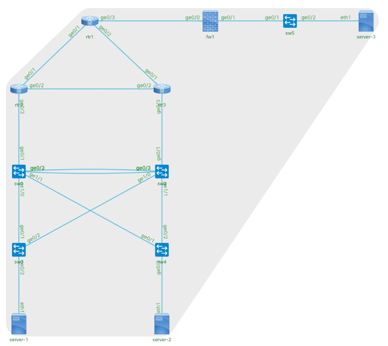

# Genie CLI Demonstartion 
I'm always on the lookout for new ways to help network engineers get into automation in a very easy, low code, low pre-req way.  In this search I don't think I've ever been as excited or impressed with anything I've seen as much as the new Genie CLI that was added to the pyATS/Genie package with Version 19. 

If you haven't run across [pyATS/Genie](https://developer.cisco.com/pyats) yet, the quick description is that they are the network verification tooling developed inside Cisco for internal engineering to test releases of IOS XE, NX-OS and, IOS XR that has been released for **[anyone to use completely free](https://developer.cisco.com/docs/pyats/#!requirements)**.  

I've [talked, blogged, and used](https://developer.cisco.com/netdevops/live/#s01) them for awhile now through native Python, Robot, and other interfaces.  And while I've always been impressed by the tooling, there was always a bit of a bar of konwledge required in these languages, and computer developement that made them difficult for brand new network automation engineers to feel comfortable jumping into. 

Well, with the release of [Genie CLI](https://pubhub.devnetcloud.com/media/pyats-packages/docs/genie/cli/index.html) we now have an amazingly powerful **and** easy to use tool for any network engineer that can solve real problems immediately.  What problems you ask?  Well, there are many potential use cases, but the one that I think shows the power the best is this one. 

> Users, or management systems, report a problem in the network. How can we find out what changed and where the problem might be? 

Let's dive right in! 

## Table of Contents
* [Preperation](#preperation)
* [Network Topology](#network-topology)
* [Demo 1: Users report Problem Communicating from Server-1 to Server-3](#demo-1-users-report-problem-communicating-from-server-1-to-server-3)
* [Key Info 1: Testbed Files and Network Devices](https://github.com/hpreston/netdevops_demos/tree/master/genie-cli-1#key-info-1-testbed-files-and-network-devices)
* [Demo 2: Occasional Network Communication Issues on Server-1 and Server-2](#demo-2-occasional-network-communication-issues-on-server-1-and-server-2)
* [Demo 3: What exactly is happening under the hood?](#demo-3-what-exactly-is-happening-under-the-hood)
* [Demo 4: CLI Commands made better with Genie Parse](#demo-4-cli-commands-made-better-with-genie-parse)
* [Demo 5: Server 2 can't communicate with anything...](#demo-5-server-2-cant-communicate-with-anything)
* [Demo 6: Non-Optimal Traffic Patterns](#demo-6-non-optimal-traffic-patterns)
* [Demo 7: Performance Problem... Somewhere](#demo-7-performance-problem-somewhere)

## Preperation
We'll explain all the details as the demo goes on, but let's get setup to run these demos.  

1. You'll need a workstation with Python 3.6 or 3.7 installed and functional along with Git.
1. Clone down the code from GitHub and change into the directory for this demo. 

	```bash
	git clone https://github.com/hpreston/netdevops_demos
	cd netdevops_demos/genie-cli-1
	```

1. Create a Python 3 virtual environment, and install the requirements (pyATS and Genie) 

	```
	python3 -m venv venv 
	pip install -r requirements.txt 
	``` 

1. Create the "normal" profile for the network.  This command can take up to 4 minutes to complete. You'll get a progress bar showing status as it runs. 

	```bash
	genie learn all --testbed-file testbeds/mock_normal_tb.yaml --output tests/normal 
	```
	
	* What this command is doing is giving Genie a baseline from which you can look for differences when something goes wrong. 

## Network Topology 


All the demos will leverage this network topology. 

## Demo 1: Users report Problem Communicating from Server-1 to Server-3 

**Situation:** You come to work with a report from the systems team that Server-1 (IP Address: 10.0.0.1) in the data center can no longer reach Server-3 (IP Address: 10.0.128.2) in the branch location. 

**Troubleshooting with Genie CLI:** This type of problem happens all the time.  And there could be hundreds of possible reasons for why this might have occurred.  You probably already have some ideas of what might be the problem, but let's see what Genie can do for us.  

1. Lucky for you, you have a known good baseline of what the network looks like when things are "normal".  If you don't, make sure to go back and run the Preperation steps above. 
1. Using Genie, let's checkout the current state of a few high potential services on the network by "learning" all about their status. 

	```bash
	genie learn interface ospf routing vlan --testbed-file testbeds/mock_break5_tb.yaml --output tests/demo1.1
	```
	
1. Once that finishes, let's compare the current state to that handy baseline of "normal". We're going to ask Genie to give us any *diff*-erences. 

	```bash 
	genie diff tests/normal tests/demo1.1 --output diffs/demo1.1
	```

1. Take a look at the output.  
	* You'll see several entries for files that are `Only in tests/normal`.  This is because the "normal" profile includes a baseline for many more network services and features than we just tested.  

		```bash
		# Example 
		|------------------------------------------------------------------------------|
		|  File: hsrp_iosxe_sw2_ops.txt                                                |
		|   - Only in tests/normal                                                     |
		|------------------------------------------------------------------------------|
		```
	
	* You'll also see many files that are reported as `Identical`.  This indicates that there are no differences between the current state and the "normal" baseline.  This means all looks pretty good on that device for that service, you can look elsewhere.  
		
		```bash
		# Example 
		|------------------------------------------------------------------------------|
		|  File: ospf_iosxe_sw4_ops.txt                                                |
		|   - Identical                                                                |
		|------------------------------------------------------------------------------|
		```

	* What you are looking for are files that have a `Diff can be found at...` status.  This indicates there is something different from the current state of the network and the network baseline.  Such as this example `routing_iosxe_rtr2_ops.txt` related to the routing state on rtr2. 

		```bash
		# Example
		|------------------------------------------------------------------------------|
		|  File: routing_iosxe_rtr2_ops.txt                                            |
		|   - Diff can be found at diffs/demo1.1/diff_routing_iosxe_rtr2_ops.txt       |
		|------------------------------------------------------------------------------|
		```
	
1. Open up the file `routing_iosxe_rtr1_ops.txt` using a command line tool (if you are hardcore), or in a text editor like Atom, VS Code, Notepad++, etc. Part of the file is shown below. 

	```diff
	--- tests/normal/routing_iosxe_rtr2_ops.txt
	+++ tests/demo1.1/routing_iosxe_rtr2_ops.txt
	info:
	 vrf:
	  default:
	   address_family:
	    ipv4:
	     routes:
	-      10.0.128.0/29: 
	-       active: True
	-       metric: 20
	-       next_hop: 
	-        next_hop_list: 
	-         1: 
	-          index: 1
	-          next_hop: 10.0.128.9
	-          outgoing_interface: GigabitEthernet0/1
	-          updated: 00:21:41
	-       route: 10.0.128.0/29
	-       route_preference: 110
	-       source_protocol: ospf
	-       source_protocol_codes: O E2
	```
	
	* See all those lines with `-` in front of them?  They indicate things that were in the network baseline, but are **NOT** present in the current status.  (Lines with `+` indicate things that are in the current baseline that were not in the baseline) 

1. Well look at that, there is a route missing on `rtr2` for the network that `Server-3` sits on (it's IP is 10.0.128.2).  That certainly seems promising.  
1. If you check the `diff_routing_iosxe_rtr3_ops.txt` you'll see it is also missing the route. 
1. Conferring with the network topology (or just looking at the next-hop details in the diff), you see that the route should be coming from `rtr1`.  Let's check the routing diff for it (`diff_routing_iosxe_rtr2_ops.txt`).  
	* Nothing will likely jump out from it... 
1. Well, looking at the files in the `diffs` directory (or the output from the `genie diff` command), you should also see there are differences in the OSPF state too. Let's checkout one of them (doesn't matter which).  Output below... 

	```diff
	--- tests/normal/ospf_iosxe_rtr3_ops.txt
	+++ tests/demo1.1/ospf_iosxe_rtr3_ops.txt
	info:
	 vrf:
	  default:
	   address_family:
	    ipv4:
	     instance:
	      1:
	       areas:
	        0.0.0.0:
	         database:
	          lsa_types:
	-           5: 
	-            lsa_type: 5
	-            lsas: 
	-             10.0.128.0 192.168.255.1: 
	-              adv_router: 192.168.255.1
	-              lsa_id: 10.0.128.0
	-              ospfv2: 
	-               body: 
	-                external: 
	-                 network_mask: 255.255.255.248
	-                 topologies: 
	-                  0: 
	-                   external_route_tag: 0
	-                   flags: E
	-                   forwarding_address: 10.0.128.5
	-                   metric: 20
	-                   mt_id: 0
	-               header: 
	-                adv_router: 192.168.255.1
	-                age: 1702
	-                checksum: 0xDC45
	-                length: 36
	-                lsa_id: 10.0.128.0
	-                option: None
	-                seq_num: 80000002
	-                type: 5
	```
	
	* Well would you look at that, there is a missing Type 5 (External) LSA for the route in question.  And it's used to be sourced by `rtr1`.  
1. External routes dropping from the table could have lots of different potential causes.  But let's rule out a configuration change first.  Genie can help us here too.  Let's ask it to "learn" the current config from `rtr1`

	```bash
	genie learn config --testbed-file testbeds/mock_break5_tb.yaml --output tests/demo1.2 --devices rtr1
	```
	
	* We could have it learn the configs from all devices, but showing how Genie allows you to focus your search. 

1. Let's run a diff against baseline.  

	```bash 
	genie diff tests/normal tests/demo1.2 --output diffs/demo1.2
	```

1. The vast majority of the files will be `Only in tests/normal` because of our focused query, but sure enough there is a difference on `rtr`. 

	```bash
	|------------------------------------------------------------------------------|
	|  File: config_iosxe_rtr1_ops.txt                                             |
	|   - Diff can be found at diffs/demo1.2/diff_config_iosxe_rtr1_ops.txt        |
	|------------------------------------------------------------------------------|
	```

1. Go ahead and open up the diff and check it out.  Shown below.  

	```diff
	--- tests/normal/config_iosxe_rtr1_ops.txt
	+++ tests/demo1.2/config_iosxe_rtr1_ops.txt
	+Current configuration : 4431 bytes: 
	-Current configuration : 4478 bytes: 
	-ip route 10.0.128.0 255.255.255.248 10.0.128.5: 
	```

1. Well look at that, a static route for the missing Type 5 LSA, and the network Server-3 is on, has been removed from the configuration.  I think we have our culprit! 

***Wasn't that pretty cool! Move onto the next demo's to learn a bit more about how it all works.***


## Key Info 1: Testbed Files and Network Devices
For Genie and pyATS to do anything, they need to have a network testbed file that provides details on the network to be tested.  Testbed files are written in YAML, and contain details on the IP addresses, Credentials, and other connection details for the network.  Here is an example testbed file. 

```yaml
testbed:
  name: genie-cli-1_default_zIaLdG
  tacacs:
      username: "%ENV{PYATS_USERNAME}"
  passwords:
      tacacs: "%ENV{PYATS_PASSWORD}"
      enable: "%ENV{PYATS_AUTH_PASS}"
      line: "%ENV{PYATS_PASSWORD}"
devices:
  rtr1:
    alias: rtr1
    os: iosxe
    type: IOSv
    connections:
      defaults:
        class: unicon.Unicon
      console:
        protocol: telnet
        ip: 172.16.30.80
  rtr2:
    alias: rtr2
    os: iosxe
    type: IOSv
    connections:
      defaults:
        class: unicon.Unicon
      console:
        protocol: telnet
        ip: 172.16.30.81
  rtr3:
    alias: rtr3
    os: iosxe
    type: IOSv
    connections:
      defaults:
        class: unicon.Unicon
      console:
        protocol: telnet
        ip: 172.16.30.82
```

> For full details on testbed file creation and format, see the [pyATS documentation](https://pubhub.devnetcloud.com/media/pyats/docs/topology/index.html)

A couple of things to note. 

* The credentials for the devices can be pulled in from environment variables, as in this example.  This is a great option for avoiding including credentials in clear text in files that you might put in source control or share. 
* The testbed includes references to the device types and OS's of the devices.  This allows Genie to use the proper connection and command information to interact with the devices.  Devices currently supported include IOS XE (`iosxe` os value valid for most IOS devices too), NX-OS, and IOS XR. 

### Mock Devices and the Testbed files used in these demos 
You may have wondered exactly what network were you talking to in Demo 1.  Well, take a look at the file [testbeds/mock_normal_tb.yml](testbeds/mock_normal_tb.yml) that represents our network in good working order. The entry for `rtr1` is shown below.  


```yaml
  rtr1:
    alias: rtr1
    os: iosxe
    type: IOSv
    connections:
      defaults:
        class: unicon.Unicon
      mock:
        command: mock_device_cli --os iosxe --mock_data_dir mocks/normal/rtr1 --state connect
        protocol: unknown
```

Under connections you should see each device does **not** have an IP address and telnet details like in the original example.  Instead there is an entry for a `command` and `mock_device_cli`.  This isn't some black magic, but it is something pretty darn close that Genie gives us.  

`mock` in this case refers to a simulated device that was created by the tools included in pyATS and Genie that enable network engineers to **record** the interactions with a real network device, and then generate a **playback** device that will accept the same commands sent to the real device, and reply in the exact same way.  This means that you can model a network in any state, and save it for later use, like in demos like this ;-) 

So what I did, was build the actual network shown in the topology, and record the network state when it was "normal" as well as during several different failure conditions.  I used those recordings to generate network `mockups` of each condition that I could store in this code repository and let anyone explore the Genie CLI without having to build a network.  

> If you would like to explore the real network, with or without Genie, the topology is a shared VIRL topology available at [github.com/virlfiles/ccnx_study](https://github.com/virlfiles/ccnx_study).  
> 
> You can use your own VIRL server, or reserve a [DevNet Sandbox](http://cs.co/sbx-multi) and quickly bring up the topology using `virl utils` with `virl up virlfiles/ccnx_study`.

You can even interact with the mock devices yourself.  Run this command to connect to the "normal" `rtr1`. 

```bash
mock_device_cli --mock_data_dir mocks/normal/rtr1 --os iosxe --state connect
```

You'll be connected to the device as if you consoled into it.  Give it a `?` to see the list of commands that are supported.  **Note, tab completion will not work on a mock device.** Go ahead and run a few commands to see that it actually works.  When you are done, press `Cntrl-C` to quit the mock. 

The mock device is simply a Python program included with pyATS/Genie that reads in a YAML file that contains all the commands and responses that were recorded by Genie.  You can checkout the file for the normal `rtr1` at [mocks/normal/rtr1/rtr1.yaml](mocks/normal/rtr1/rtr1.yaml).

Circling back to the testbeds, within the [testbeds/](testbeds/) directory in this repository are testbed files for the network in "normal" state as well as a series of different "break" conditions.  The demos here each use one of the broken testbeds files to represent the network in some degraded condition.  *And while a simulated (or mocked) network, remember that each condition was really created and recorded exactly for your use.  The output and behavior is from an actual functional topology.*

We only touched on the basics of mock devices and playback.  For more details, checkout the docs. 

* [Playback Docs](https://pubhub.devnetcloud.com/media/pyats-packages/docs/unicon/playback/index.html)

## Demo 2: Occasional Network Communication Issues on Server-1 and Server-2

**Situation:** You have noticed some occasional problems with some of the servers in the data center.  

**Troubleshooting with Genie CLI:** Let's walk through how we can troubleshoot this with the Genie CLI  

* For this demo we'll be using the testbed file [testbeds/mock_break4_tb.yaml](testbeds/mock_break4_tb.yaml)
* The "mocks" for this testbed are at [mocks/break4/](mocks/break4/)

1. We'll start our troubleshooting by focusing in on the devices within the data center.  So `rtr2`, `rtr3`, `sw1`, `sw2`, `sw3`, & `sw4`. While it is always possible soemthing from the WAN or Branch could be causing a problem, odds are it's closer to the symptom. 
1. Let's start by learning the `routing` and `vlan` details and seeing if there's anything different.  
	
	```bash
	genie learn routing vlan --testbed-file testbeds/mock_break4_tb.yaml --output tests/demo2.1 --devices rtr2 rtr3 sw1 sw2 sw3 sw4
	```

1. And now we'll compare to normal and look for diffs. 
	
	```bash
	genie diff tests/normal tests/demo2.1 --output diffs/demo2.1
	```

1. Check the `diffs/demo2.1` folder to see what diffs came up.  
1. Take a look at the reported diffs on routing state from the routers.  
	* `rtr2` has some interesting changes in some missing next hops for a couple networks. 
	* `rtr3` has some big changes.  Looks like a couple routes have been added, and others removed.  
1. Defintely something a bit bizzare there.  Let's take a look at the interfaces to see if anything changed.  We'll focus in on the two routers.  

	```bash
	genie learn interface --testbed-file testbeds/mock_break4_tb.yaml --output tests/demo2.2 --devices rtr2 rtr3 
	```

1. And now calculate the diffs.  

	```bash
	genie diff tests/normal tests/demo2.2 --output diffs/demo2.2
	```

1. And check the `diffs/demo2.2` folder to see if anything came up.  
	* Well there sure was.  You should see an output like this, a clear indication that the IP address on Gigabit0/3 has been changed.  

	```bash
	--- tests/normal/interface_iosxe_rtr3_ops.txt
	+++ tests/demo2.2/interface_iosxe_rtr3_ops.txt
	info:
	 GigabitEthernet0/3:
	  ipv4:
	-   10.0.0.4/29: 
	-    ip: 10.0.0.4
	-    prefix_length: 29
	-    secondary: False
	+   10.1.0.4/29: 
	+    ip: 10.1.0.4
	+    prefix_length: 29
	+    secondary: False
	```
	
1. You probably know what's coming... let's check the config on `rtr3` and then compare it with normal. 

	```bash
	genie learn config --testbed-file testbeds/mock_break4_tb.yaml --output tests/demo2.3 --devices rtr3
	genie diff tests/normal tests/demo2.3 --output diffs/demo2.3
	```

1. Probably came as no surprise that there was a configuration change to the IP address on GigabitEthernet0/3.

## Demo 3: What exactly is happening under the hood? 
In this demo we're going to look a bit closer at what is going on when we run the `genie` commands. 

* We'll use the normal testbed for this one: [testbeds/mock_normal_tb.yaml](testbeds/mock_normal_tb.yaml)

1. Run a simple learn for `interface` details on `rtr1`. 

```bash
genie learn interface --testbed-file testbeds/mock_normal_tb.yaml --output tests/demo3.1 --devices rtr1
```

1. The output of this command should look like this.  

	```text
	Learning '['interface']' on devices '['rtr1']'
	100%|███████████████████████████████████████████████████████████████████████████████████| 1/1 [00:01<00:00,  1.01s/it]
	+==============================================================================+
	| Genie Learn Summary for device rtr1                                          |
	+==============================================================================+
	|  Connected to rtr1                                                           |
	|  -   Log: tests/demo3.1/connection_rtr1.txt                                  |
	|------------------------------------------------------------------------------|
	|  Learnt feature 'interface'                                                  |
	|  -  Ops structure:  tests/demo3.1/interface_iosxe_rtr1_ops.txt               |
	|  -  Device Console: tests/demo3.1/interface_iosxe_rtr1_console.txt           |
	|==============================================================================|
	```
	
	* Notice that there are a few files referenced that were created.  
1. There will always be a `connection_???.txt` file that shows the output from the device when Genie made the initial connection to the device. If you open the file you'll see that Genie is connecting over CLI to the device, and setting the terminal up for some efficient gathering of data. 
1. For every "Learnt" feature, there are two files created.  
1. The `_console.txt` file is all the console output showing every command that Genie ran and the device output.  That's right, ***Genie runs CLI commands, just like you would to learn about a feature.***
	* Open up the `tests/demo3.1/interface_iosxe_rtr1_console.txt` file and take a look at the commands that were ran and the output.  If you are like me, you'll see Genie ran the same commands you would have, but also a whole lot of commands you **never would have thought to run**. That's the power of all the network experts behind Genie.
1. The `_ops.txt` file is a parsed and processed version of all the gathered data about the feature.  This is where Genie's "magic" comes in.  All that console output is processed by Genie and turned into a Python object (dictionaries and lists).  Then the Genie CLI "dumps" all that data out to JSON text file. 
	* Open up the `tests/demo3.1/interface_iosxe_rtr1_ops.txt` file and take a look. 
	* It might take a second for it to sink in, but consider the fact that with a simple `genie learn interface` command you get all that data scrubbed and made available in a data format that is easy to use. 
	* In fact, you could read this file into your own program and immediately process and use the data however you wanted.  
	* And even better, if you `learn interface` from an IOS XE, NX-OS, and IOS XR device, the data format in the created `ops.txt` file would be **exactly the same**.  Making comparing operational state between platforms very very very very easy. 

### What about `genie diff`?  
Comparing two text files and reporting the differences is something very straightforward and used all over the place in IT. 

You may have used `diff` features in Notepad++ or another text editor before to look for changes in network templates. 

Or if you've been working with `git` at all, you may have seen and used `git diff` before.  

Or maybe you've seen the output in GitHub comparing the changes to a file from one commit to another.  

The point is, doing a `diff` is pretty simple for computers.  All Genie is doing is looking for changes in the `_ops.txt` versions of the files and saving the details to another directory for you to look at.  

Simple really :-) 

### What can Genie "learn"? 
So far we've used Genie to "learn" about a few different things.  How do you know what can be learned? Well, the easiest way to see is to check the [documentation](https://pubhub.devnetcloud.com/media/pyats-packages/docs/genie/genie_libs/#/models) for the models list supported by Genie.  

Each of the models represents a network feature that Genie can learn.  Not every model is supported by every platform, you can explore the documents to see details.  

And the team behind Genie is constantly creating new models, so check back often! 

## Demo 4: CLI Commands made better with Genie Parse
In this demo we're going to step back from the overwhelming power of `genie learn` and dig in a bit to how Genie does all that learning.  

We've already explored how Genie runs CLI commands and magically turns the text output into wonderful Python and JSON data structures.  This is called "parsing" and Genie comes with a [HUGE library of parsers](https://pubhub.devnetcloud.com/media/pyats-packages/docs/genie/genie_libs/#/parsers).  Let's check them out a bit.  

* We'll use the normal testbed for this one: [testbeds/mock_normal_tb.yaml](testbeds/mock_normal_tb.yaml)

1. Let's start with something simple, interfaces.  What's a network device without interfaces after all.  And our most common interface checking CLI command?  Well `show ip interface` of course.  Let's have Genie run and parse it.  

	```bash
	genie parse "show ip interface" --testbed-file testbeds/mock_normal_tb.yaml --devices rtr1
	```

1. Take a look at the output.  You'll see all the details from the command you're used to, but they have been made into a JSON object automatically.  Pretty sweet right?  If you've messed around with automating with CLI through other Python libraries, you've likely struggled with finding the important bits of data buried in the string output.  Regular Expressions, string "finds", Text FSM, etc... all tools in Python that you can use, but the best option is not needing to do it. 

1. Navigate to the [Genie Parser Documentation](https://pubhub.devnetcloud.com/media/pyats-packages/docs/genie/genie_libs/#/parsers) and scroll through the different parsers available for the operating systems.  
1. Our devices in this lab are IOS XE devices, so pick a parser command and try it out! 
	* Note, some of the available parsers may NOT have been run and captured to the mock devices we are using.  If you get no data, just try a different one, **most** were captured.  

	```bash 
	# Example
	genie parse "show ip route" --testbed-file testbeds/mock_normal_tb.yaml --devices rtr1
	```

1. Now let's suppose you wanted to save this output to a file, rather than just display to the screen.  Simply add `--output <directory>` to the end of the command.  Let's save the output of the routing table for later use.  

	```bash 
	genie parse "show ip route" --testbed-file testbeds/mock_normal_tb.yaml --devices rtr1 --output rtr1-routes
	```
	
	* In the folder will be the connection log, raw console output, and the parsed data. 
	* This is basically what `genie learn` is doing, but for lots and lots and lots of commands related to the feature being learned.  

1. Take some time and run a few more parse examples.  Be wowed and amazed, it's okay.  


## Demo 5: Server 2 can't communicate with anything...

**Situation:** The systems team reports problems with Server 2's network connection. 

**Troubleshooting with Genie CLI:** Use `genie learn` and `genie diff` to track down the problem.  Try to avoid the temptation to just jump right to `genie learn config` and see if you can find it through the operational state.  Afterall, not every network problem will be because of a configuraiton change... 

**Hints:** Some handy models to check include `routing`, `static_routing`, `acl`, `vlan`, `interface`, `arp` 

## Demo 6: Non-Optimal Traffic Patterns

**Situation:** The Network Ops team has noticed some odd traffic patterns across the network

**Troubleshooting with Genie CLI:** Use `genie learn` and `genie diff` to track down the problem.  Try to avoid the temptation to just jump right to `genie learn config` and see if you can find it through the operational state.  Afterall, not every network problem will be because of a configuraiton change... 

**Hints:** Some handy models to check include `routing`, `static_routing`, `acl`, `vlan`, `interface`, `arp` 

## Demo 7: Performance Problem... Somewhere

**Situation:** Time for a bit of a hunt... there's some misconfiguration in the network... can you find it. 

**Troubleshooting with Genie CLI:** Use `genie learn` and `genie diff` to track down the problem.  Try to avoid the temptation to just jump right to `genie learn config` and see if you can find it through the operational state.  Afterall, not every network problem will be because of a configuraiton change... 