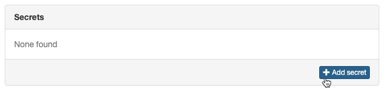
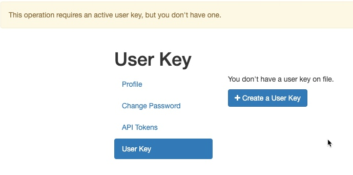
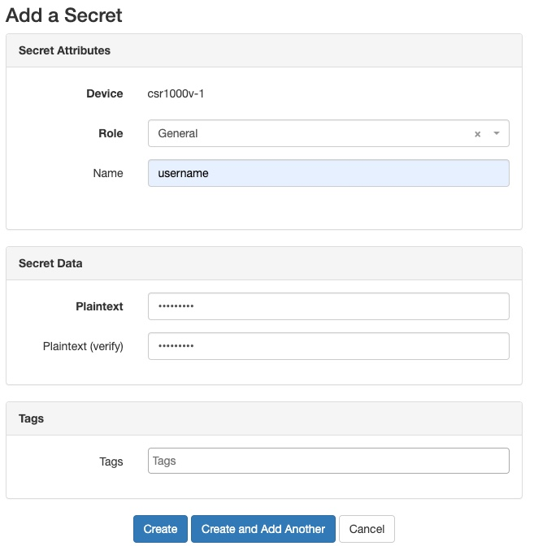
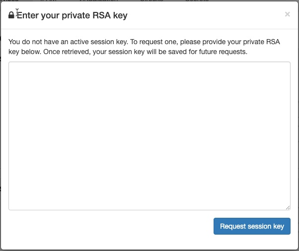
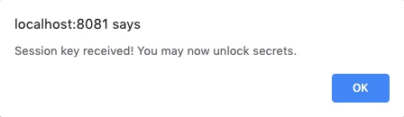
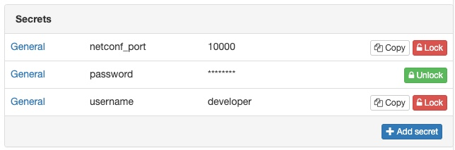
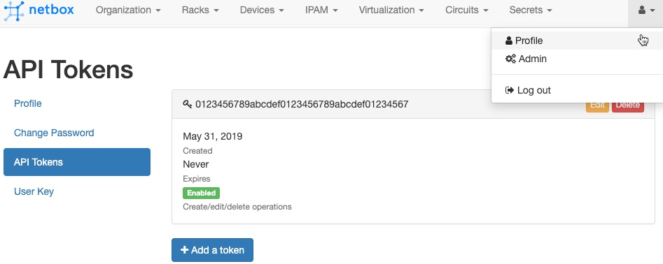

# NetDevOps Automating Safely Demos 
This repo contains a series of demos related to security best practices and suggestions.  These demos are intended to accompany the content in the NetDevOps Live! Episode [Automate Safely, NetDevOps Security Strategies](https://developer.cisco.com/netdevops/live/#s02t10).  Checkout the episode for a video delivery of the demos and background content.  

### Table of Contents 

* [Sandbox Used](#sandbox-used)
* [Preparing to Run the Demos](#preparing-to-run-the-demos)
	* [NetBox Setup: Starting a Development Instance on your Laptop with Docker](#netbox-setup-start-a-development-instance-on-your-laptop-with-docker)
* [API Access Control Demos](#api-access-control-demos)
	* [NETCONF Access Control Model (NACM)](#netconf-access-control-model-nacm)
* [Secret Management Demos](#secret-management-demos)
	* [Exploring Environment Variables and Python](#exploring-environment-variables-and-python)
	* ["Sourcing" Environment Variable Files](#sourcing-environment-variable-files)
	* [Environment Variables and Ansible](#environment-variables-and-ansible)
	* [Environment Variables and Genie Testbeds](#environment-variables-and-genie-testbeds)
	* [Encrypting Secrets with Ansible Vault](#encrypting-secrets-with-ansible-vault)
	* [Storing Secrets in a "Source of Truth" such as NetBox](#storing-secrets-in-a-source-of-truth-such-as-netbox)

## Sandbox Used 
These demo's leverage the [IOS XE on CSR Latest Code Always On Sandbox](https://devnetsandbox.cisco.com/RM/Diagram/Index/38ded1f0-16ce-43f2-8df5-43a40ebf752e?diagramType=Topology) from DevNet.  This sandbox offers direct access to SSH, NETCONF, & RESTCONF interfaces on a sample IOS XE device right on the internet.  

## Preparing to Run the Demos 
If you'd like to run the demos, here's everything you should need to know and do.  

> Note: You'll need Python3.6+ installed, along with Docker.  And for the Ansible and Genie demo examples you'll need a Linux or macOS environment to run them within.  Windows Subsystem for Linux (WSL) should work.  

### Gitting the code and Setting up Python
1. Clone down this demo repo and jump into the folder for this demo.  

	```bash
	git clone https://github.com/hpreston/netdevops_demos
	cd netdevops-security 
	```

1. Create a Python Virtual Environment (if you aren't already in one). 

	```bash
	python3 -v venv venv 
	source venv/bin/activate
	```
	
1. Install the Python libraries used in the demo. 

	```bash
	pip install -r requirements.txt
	```

### NetBox Setup: Start a Development Instance on your Laptop with Docker
To run the `secret_vault/vault_netbox_demo.py` you'll need to have a local development instance of NetBox up and running.  Luckily it is pretty easy to start an instance of NetBox right on your laptop as long as you've docker installed. 

> Instructions from [netbox-community/netbox-docker on GitHub](https://github.com/netbox-community/netbox-docker)

1. Open a new terminal window or tab, and clone down the repo and change into it.  

	```bash
	git clone https://github.com/netbox-community/netbox-docker
	cd netbox-docker
	```

1. You can hard set the port for NetBox before running `docker-compose up` by opening up the `docker-compose.yml` file and updating the ports line for nginx to set a specific port.  For example here it is set to use port `8081` locally. You'll want to do this so the NetBox URL from the examples match.

	```yaml
	nginx:
	    command: nginx -c /etc/netbox-nginx/nginx.conf
	    image: nginx:1.15-alpine
	    depends_on:
	    - netbox
	    ports:
	    - 8081:8080
	```

1. Start up netbox with docker-compose

	```bash
	docker-compose up -d
	```

	* This can take a couple mintues to complete fully.  

1. Open up a web browser and navigate to `http://localhost:8081`
1. You can login with `admin / admin` and look around.  You shouldn't see any data just yet.  

	

1. Now return to the terminal window for these demos and run the `netbox_sandbox_add.py` script.  This adds the IOS XE Latest Always On device to Netbox with minimal settings.  

	```bash
	$ python netbox_sandbox_add.py
	```

	> There won't be any output, but if you check NetBox you should now have a `csr1000v-1` device listed.

## API Access Control Demos 

### NETCONF Access Control Model (NACM) 
NACM is part of the NETCONF standard and allows for very granular control over the actions and models users have access to.  

1. First, we'll create a new PRIV01 user on the sandbox for our demonstration.  We'll go old-school and do this over ssh ☺️. 

	```bash
	ssh -p 8181 developer@ios-xe-mgmt-latest.cisco.com 
	# password is C1sco12345
	
	config t
	username priv1user password C1sco12345
	```

1. Now log in with the user to test and show the privilege.  

	```
	ssh -p 8181 priv1user@ios-xe-mgmt-latest.cisco.com 
	# password is C1sco12345
	
	show priv
	
	! Output
	Current privilege level is 1
	```
	
1. By default, IOS XE NACM policy only allows PRIV15 users to leverage NETCONF.  The script `api-access/api_priv_readonly_netconf.py` will apply a new rule that will allow `PRIV01` users ability to execute `<get>` RPCs against all models.

	```xml
	<nacm xmlns="urn:ietf:params:xml:ns:yang:ietf-netconf-acm">
	<rule-list>
	  <name>only-get</name>
	  <group>PRIV01</group>
	
	  <rule>
	    <name>deny-edit-config</name>
	    <module-name>ietf-netconf</module-name>
	    <rpc-name>edit-config</rpc-name>
	    <access-operations>exec</access-operations>
	    <action>deny</action>
	  </rule>
	  <rule>
	    <name>allow-get</name>
	    <module-name>ietf-netconf</module-name>
	    <rpc-name>get</rpc-name>
	    <access-operations>exec</access-operations>
	    <action>permit</action>
	  </rule>
	  <rule>
	    <name>allow-models</name>
	    <module-name>*</module-name>
	    <access-operations>read</access-operations>
	    <action>permit</action>
	  </rule>
	</rule-list>
	</nacm>
	```
	
	> The script will first print the starting NACM rules.  You can re-run the script to see the changes, re-applying over and over is fine. 
	
1. Run the script to apply the changes.  
	
	```bash
	python api-access/api_priv_readonly_netconf.py
	```

1. Let's see if it works.  Run `api-access/api_priv_demo1.py` which is a script that will use NETCONF to retrieve (`<get>`) the list of interfaces from the sandbox.  
	> The script will prompt for the user to test with.  Use the `priv1user / C1sco12345` user we setup. 
	
	```bash
	python api-access/api_priv_demo1.py
	```
	
	* This works, as expected from the NACM rules. 

1. Now let's try an edit operation.  Run `api-access/api_priv_demo2.py` which is a script to use NETCONF to add (`<edit-config>`) a loopback interface to the router.  
	> The script will prompt for the user to test with.  Use the `priv1user / C1sco12345` user we setup. 
	
	```bash
	python api-access/api_priv_demo2.py
	```

	```bash
	#Output
	Network Username?
	priv1user
	Network Password?
	
	Let's create a new loopback interface.
	What loopback number?
	89
	What interface description?
	New Loopback by Priv01 User
	What IP address?
	172.16.100.1
	What subnet mask?
	255.255.255.255
	There was an error (access-denied) with your transaction.
	```	
	
	* Okay, that didn't work (we didn't expect it to)

1. Now re-run that script, but use the admin account of `developer / C1sco12345`.  

	```bash
	$ python api-access/api_priv_demo2.py
	```
	
	```
	# Output
	Network Username?
	developer
	Network Password?
	
	Let's create a new loopback interface.
	What loopback number?
	199
	What interface description?
	New Loopback by Priv15 user
	What IP address?
	172.32.255.1
	What subnet mask?
	255.255.255.255
	NETCONF RPC OK: True
	```
	
	* That worked! 

1. Re-run `python api-access/api_priv_demo1.py` as `priv1user` and see that you can see the new interface as a low priv user! 

## Secret Management Demos
Secrets are anything you don't want everyone to know (pretty obvious huh).  Let's see some ways you can keep them more secure.  

### Exploring Environment Variables and Python 
First let's checkout environment variables in an interactive python setup.  

1. First, let's setup some environment variables.  From bash, run this to setup 4 environment variables.

	```bash
	export SBX_ADDRESS=ios-xe-mgmt-latest.cisco.com
	export SBX_NETCONF_PORT=10000
	export SBX_USER=developer
	export SBX_PASS=C1sco12345
	```

1. Now start up `ipython`. 
1. Now in python, run these commands to see how the `os` library provides easy access to environment variables.  
	
	```bash
	# Import the OS library
	import os
	
	# Print out all environment variables
	os.environ
	
	# Get value of relevant device information
	os.environ["SBX_ADDRESS"]
	os.environ["SBX_USER"]
	os.environ["SBX_PASS"]
	```
	
1. But what about when you ask for an ENV that doesn't exist? `os.getenv` is a method that will return `None` if not found. 

	```bash
	# See what happens when you try to access an ENVAR that doesn't exist
	os.environ["SBX_MISSING"]
	
	# Use os.getenv to lookup value or return None
	address = os.getenv("SBX_ADDRESS")
	missing = os.getenv("SBX_MISSING")
	
	# See what values are
	address
	missing
	
	# You can test if an env_var existed
	missing is None
	```
	
1. Now create a couple device dictionaries for potential network devices.  `bad_device` tries to use a `MISSIN` password.  


	```python
	# Creating our Device information from EnvVars
	device = {
	    "address": os.getenv("SBX_ADDRESS"),
	    "username": os.getenv("SBX_USER"),
	    "password": os.getenv("SBX_PASS"),
	    "netconf_port": os.getenv("SBX_NETCONF_PORT"),
	}
	
	# Creating a device where some infromation not available
	bad_device = {
	    "address": os.getenv("SBX_ADDRESS"),
	    "username": os.getenv("SBX_USER"),
	    "password": os.getenv("SBX_MISSING"),
	    "netconf_port": os.getenv("SBX_NETCONF_PORT"),
	}
	```

1. But you can test to make sure you have everything you need to work.  

	```python
	# How we can verify all details exist
	None in device.values()
	None in bad_device.values()
	
	# Great if check before continuing
	if None in device.values():
	    raise Exception("Missing key piece of data to connect to device")
	```
	
1. With our details, we can now use them to retrieve network info.  
	
	```python
	# Import our Network Autoamtion libraries
	from ncclient import manager
	import xmltodict
	
	# Use NETCONF to connect to device and retrieve interface list
	with manager.connect(
	    host=device["address"],
	    port=device["netconf_port"],
	    username=device["username"],
	    password=device["password"],
	    hostkey_verify=False,
	) as m:
	
	    filter = """
	    <filter>
	      <interfaces xmlns="urn:ietf:params:xml:ns:yang:ietf-interfaces" />
	    </filter>
	    """
	
	    r = m.get_config("running", filter)
	
	# Convert XML data into interface list
	interfaces = xmltodict.parse(r.xml)["rpc-reply"]["data"]["interfaces"]["interface"]
	
	# How many we get?
	len(interfaces)
	
	# Print out and process
	for interface in interfaces:
	    print(interface["name"])
	```
	
### "Sourcing" Environment Variable Files 
Manually `exporting` in a terminal is error prone and time consuming... there is a better way.  

1. Make a copy of `src_env.template` as `src_env`. 

	```bash
	cp src_env.template src_env
	```

1. Edit this new file and provide the details for our sandbox. Full output shown. 

	```bash
	# Copy file to src_env
	# Complete with "secrets"
	# 'source src_env' before running code
	export SBX_ADDRESS=ios-xe-mgmt-latest.cisco.com
	export SBX_NETCONF_PORT=10000
	export SBX_SSH_PORT=8181
	export SBX_RESTCONF_PORT=9443
	export SBX_USER=developer
	export SBX_PASS=C1sco12345
	```

1. Now use `source src_env` to setup these environment variables in your active shell.  
1. Now your scripts can use these variables.  

	```
	python env_vars/env_var_demo1.py
	```
	
### Environment Variables and Ansible 
Ansible can leverage environment variables for secrets as well.  

1. Take a look at `env_vars/host_vars/device.yml`. The `lookup()` filter supports retrieving ENV. 

	```yaml
	---
	ansible_connection: network_cli
	ansible_network_os: ios
	ansible_host: "{{ lookup('env', 'SBX_ADDRESS') }}"
	
	# Statically setting port due to Jinja only returning strings
	# See issue: https://github.com/ansible/ansible/issues/30366
	# Prefer to use: "{{ lookup('env', 'SBX_SSH_PORT') | int }}"
	ansible_port: 8181
	
	ansible_user: "{{ lookup('env', 'SBX_USER') }}"
	ansible_password: "{{ lookup('env', 'SBX_PASS') }}"
	ansible_become: yes
	ansible_become_method: enable
	ansible_become_password: "{{ lookup('env', 'SBX_PASS') }}"
	```
	
	> Note: due to the way Jinja works, convering the SSH port to an integer wasn't straightforward so it's statically set in this demo. 

1. Run the playbook and see that all works as expected.  
	
	```bash
	cd env_vars
	ansible-playbook -i ansible-hosts env_var_ansible_demo.yml
	```
	
### Environment Variables and Genie Testbeds 
Genie/pyATS can pull details from environment variables within testbed files.  

1. Take a look at `env_vars/genie-testbed.yaml`. `"%ENV{SBX_PASS}"` pulls the details into the testbed dynamically. 
	
	```yaml
	---
	testbed:
	  name: netdevops-security
	  tacacs:
	      username: "%ENV{SBX_USER}"
	  passwords:
	      tacacs: "%ENV{SBX_PASS}"
	      enable: "%ENV{SBX_PASS}"
	
	devices:
	  csr1000v-1:
	    os: iosxe
	    type: iosxe
	    connections:
	      defaults:
	        class: unicon.Unicon
	      ssh:
	        protocol: ssh
	        ip: "%ENV{SBX_ADDRESS}"
	        port: "%ENV{SBX_SSH_PORT}"
	```

1. Run the `env_vars/env_var_genie_demo.py` to put this testbed to work. 
	> You'll need to be in the `env_vars` directory . 
	
	```bash 
	python env_var_genie_demo.py
	```

### Encrypting Secrets with Ansible Vault
Another option for secrets is to encrypt them into a secure file that **can** be safely included in source control.  Ansible includes `ansible-vault` which can do this for you.  

1. Move into the `secret_vault` directory within this demo folder.  
1. Take a look at `host_vars/device.insecure.yaml`.  This file contains clear text versions of all the secrets. 
	> Note: normally you would **NEVER** include the *insecure* version of a file in a repository, but would include the *secured* version.  This demonstration is about how to do the encryption so it's a bit backward here... 🤔
	
	```yaml
	---
	ansible_connection: network_cli
	ansible_network_os: ios
	ansible_host: ios-xe-mgmt-latest.cisco.com
	ansible_port: 8181
	ansible_user: developer
	ansible_password: C1sco12345
	ansible_become: yes
	ansible_become_method: enable
	ansible_become_password: C1sco12345
	```

1. Now use `ansible-vault` to encrypt this file as `device.yml`.  You'll be prompted for a password to use for the encryption.  *Don't forget what you provide, you'll need it to use the encrypted data.*

	```bash
	ansible-vault encrypt --output=host_vars/device.yml \
	 	host_vars/device.insecure.yml
	
	New Vault password:
	Confirm New Vault password:
	Encryption successful
	```

1. Take a look at the new `host_vars/device.yml` file.  This is encrypted and now safe to store in source control. 

	```
	$ANSIBLE_VAULT;1.1;AES256
	36653965633365323237656639373032356462383232386662396231353430613131616265376366
	3735623763623835343666613637663537656162643236350a343865306339333865633161636231
	33763623835343666613637663....
	```

	1. Now that you've encrypted your secrets, you can use them when running a playbook.  
	
	```bash
	ansible-playbook -i ansible-hosts \
		--ask-vault-pass vault_ansible_demo.yml
	
	Vault password:
	
	```
	
### Storing Secrets in a "Source of Truth" such as NetBox
NetBox is an open source DCIM and IPAM tool that is becoming very popular with network automation engineers and enterprises looking for a powerful and programmable Source of Truth for their automation.  NetBox can store secrets along with other device information.  

> Be sure you've setup NetBox as described above before continuing.  

***We'll start with taking a look at storing secrets in NetBox using the GUI.***  

1. Log into [http://localhost:8081](http://localhost:8081) as `admin / admin`. 
1. Navigate to `Devices > Devices` and select the `csr1000v-1`. 
1. Click the button to **+ Add secret**. 

	

1. NetBox uses public/private keys to secure keys.  You'll be presented with a screen to add a new key.  

	

1. Click **+Create a User Key**.  Click the button to **Create new keypair**.  

	

1. Create a new file in the `secret_vault` directory called `id_rsa` and copy the contents of the Private Key to this file.  Repeate with new file `id_rsa.pub` and the Public Key. 
	> **IMPORTANT TO COPY THESE KEYS BEFORE CLICKING `I have saved my new private key`. IF YOU DON'T, YOU WON'T BE ABLE TO GET THE PRIVATE KEY AGAIN.**
1. After saving the key files locally, click the **I have saved my new private key** button.  Then click **Save** on the **User Key** page.  
1. Great, you've now setup the keys so you can begin adding Secrets to NetBox.  
1. Navigate back to `Devices > Devices` and select the `csr1000v-1`. 
1. Click **+Add secret** again.
1. Choose "General" as the role and name the secret `username`.  Provide a Plaintext value of `developer` and confirm (it will be hidden).  
	> The secret role of "General" was created by the initial baseline script that you ran before starting. 
	
	

1. Click **Create** 
2. You'll be prompted to **Enter your private RSA Key**.  While you provide the public key already, in order to add (or view) keys you need to authenticate properly with the private key.  

	

1. Open up the `id_rsa` file that is your private key, and copy/paste the data into the window.  Click **Request session key**.
1. You should get a success message like this. 

	

1. Now click **Create and Add Another**. Add two more secrets of: 
	* **Name:** `password` **Plaintext:** `C1sco12345`
	* **Name:** `netconf_port` **Plaintext:** `10000`
1. After added, return to `Devices > Devices` and select the `csr1000v-1`. You should now see your secrets listed.  Click **Unlock** to view them in clear text.  

	
	
	> If you log out and back in, you'll need to provide your private key again to unlock or add new secrets.  
	
**Now that we have our secrets stored, let's use them in our script.** 

1. Take a look at the file `secret_vault/vault_netbox_demo.py`. This is a Python script that will retrieve the plaintext values of the secrets from NetBox for the device and use them with a NETCONF request.  
1. This part of the script show's how the `pynetbox` library can be used to interact with NetBox. 

	```python 
	# Create a NetBox API connection
	nb = pynetbox.api(nb_url, token=nb_token, private_key_file=private_key_file)
	
	# Retrieve device details
	nb_device = nb.dcim.devices.get(name=device_name)
	
	# Gather needed connection details for the device
	# username, password and netconf_port being retrieved from NetBox Secret Store
	device = {
	    "address": nb_device.primary_ip.address.split("/")[0],
	    "username": nb.secrets.secrets.get(
	        device_id=nb_device.id, name="username"
	    ).plaintext,
	    "password": nb.secrets.secrets.get(
	        device_id=nb_device.id, name="password"
	    ).plaintext,
	    "netconf_port": nb.secrets.secrets.get(
	        device_id=nb_device.id, name="netconf_port"
	    ).plaintext,
	}
	```
	
1. Some key details about the code to notice: 
	1. In order to use the API for NetBox, you need to provide a `token`.  You'll see where to find this in the GUI in the next tep. 
	1. If you will be working with secrets, you need to provide your `private_key` or `private_key_file` when you create the API object.  If you don't plan to access secrets, you can leave this out. 
	1. The method `nb.secrets.secrets.get()` is used to retrieve a secret.  You need to provide a `device_id` or `device` name, and the `name` of the secret you want.  Once you have a secret, the `.plaintext` property will be the clear text version of the secret. 
1. Now let's run the script `secret_vault/vault_netbox_demo.py`.  When you run it you'll be asked for your device name (`csr1000v-1`), your API Token, and the Private Key File (`id_rsa`).  
	* Find the API key in your "Profile" and "API Tokens". 

		
	
		> Note: as a development instance of NetBox, the default API token is always `0123456789abcdef0123456789abcdef01234567`.  If you are going to use NetBox in production see documentation on how to deploy securely.  
	
	```bash
	$ python vault_netbox_demo.py
	What is your device name?
	csr1000v-1
	What is your NetBox API Token?
	
	Where is your Private Key for Secret Access?
	id_rsa
	```