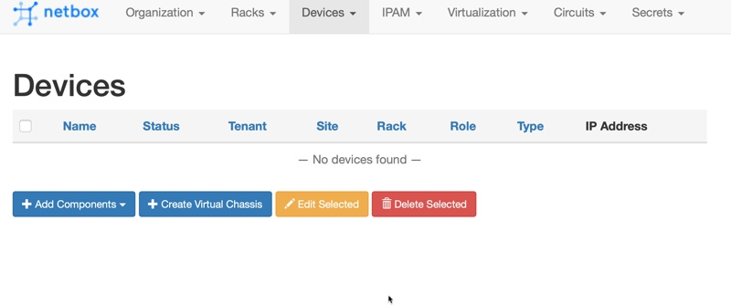
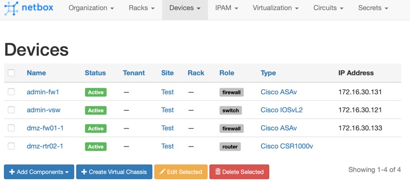

# pyATS to netbox Loader 
I've been using netbox both in demos as well as within my production day-job network for both Data Center Infra Management (DCIM) and IP Address Management (IPAM).  Like all management and documetation tools, netbox is only as good as the information that it contains, and it can be hard to find time to manually add or update it with information from your network. This has lead me to several automation efforts to bulk add details to netbox, with the latest being the first that was general enough that it could be useful for others.  

I've been using [pyATS and Genie](http://developer.cisco.com/pyats/) regularly to verify and gather operational details from my network. It occured to me that it would be pretty straightfoward to populate netbox wtih this data using it's programmatic interfaces, so that's what I've built.  

## Disclaimer 
While I do think this tool can be helpful for others, I highly recommend thorough testing and understanding of what the results in netbox will be before you run it against a "production" netbox instance.  There are some assumptions and "standards" related to device types, models, manufacturers, etc that are made within the loading tool that **maynot** match your own environment.  

Luckily netbox makes it quite easy to standup a development instance with docker or just natively running.  I **highly** recommend something along the lines of standing up a dev instance on your local laptop to target to run against.  I'm a big fan of [netbox in docker](https://github.com/netbox-community/netbox-docker)

Also, while the tool uses pyATS and Genie to only READ information from your network, you shoudl become familiar with it in a lab or test environment before using your production network.  A great way to practice is with VIRL and the [Multi-IOS Sandbox](http://cs.co/sbx_multi) on DevNet Sandbox. You can use any of the avaiable topologies, or bring your own.  

## Using the tool 
Here's a quick breakdown on how to use the tool.  The steps assume you're already setup with a VIRL server (such as the Sandbox above).  

### Setting up a Network to Test
1. Clone down this demo repo and jump into the folder for this demo.  

	```bash
	git clone https://github.com/hpreston/netdevops_demos
	cd pyats-to-netbox 
	```

1. Create a Python Virtual Environment (if you aren't already in one). 

	```bash
	python3 -v venv venv 
	```

1. Install `virlutils`, `genie`, and `pynetbox` libraries. 
	* We'll use virlutils to easily create the pyATS testbed file. 
	* pynetbox is used for interacting with netbox. 

	```bash
	pip install -r requirements.txt 
	```

1. If you already have a virl simulation running that you want to work with, "use it" with virl use.  For example. 

	```bash
	# list running simulations 
	virl ls --all 
	
	# with your desired SIM-NAME
	virl use SIM-NAME
	```

1. If you don't have a simulation running, you can start one from a default topology by selecting one from `virl search` and then `virl up NAME` including the repo.  Such as here. 
	
	```bash
	virl up virlfiles/datacenter
	```
	

### Getting pyATS/Genie accessing your network 
1. Now generate a pyATS testbed file for your simulation.  

	```bash
	virl generate pyats 
	```

	* This create `default_testbed.yaml`, a YAML file with the connection and topology information for your simulation listed. 

1. The testbed file that is created does **NOT** contain the credentials for the devices, but rather expects to pull them from your environment variables.  I've included a `src_env` file in the repo that will set these to the default `cisco / cisco` used in VIRL.  "Source" this file to set these in your terminal. 

	```bash
	source src_env
	```

	* It also includes the NETBOX ENV assuming a basic development instance running locally.  More on this later. 

1. Verify pyATS and Genie are working by using the Genie CLI to parse `show version` from the devices in the simulation.  

	```bash
	genie parse "show version" --testbed default_testbed.yaml
	```

	* *Note: if you have any ASAvs in your simulation you will get errors from Genie that the device is not supported.  This is expected at this time, but the ASAv will still be added to netbox*
	* You should see output that looks like this, once for each device in the topology.  

		```json
		{
		  "version": {
		    "chassis": "CSR1000V",
		    "chassis_sn": "9533BLM5E1C",
		    "curr_config_register": "0x2102",
		    "disks": {
		      "bootflash:.": {
		        "disk_size": "7774207",
		        "type_of_disk": "virtual hard disk"
		      },
		      "webui:.": {
		        "disk_size": "0",
		        "type_of_disk": "WebUI ODM Files"
		      }
		    },
		    "hostname": "dmz-rtr02-1",
		    "image_id": "X86_64_LINUX_IOSD-UNIVERSALK9-M",
		    "image_type": "production image",
		    "last_reload_reason": "Reload Command",
		    "license_level": "ax",
		    "license_type": "Default. No valid license found.",
		    "main_mem": "1217428",
		    "mem_size": {
		      "non-volatile configuration": "32768",
		      "physical": "3018864"
		    },
		    "next_reload_license_level": "ax",
		    "number_of_intfs": {
		      "Gigabit Ethernet": "6"
		    },
		    "os": "IOS-XE",
		    "platform": "Virtual XE",
		    "processor_type": "VXE",
		    "rom": "IOS-XE ROMMON",
		    "rtr_type": "CSR1000V",
		    "system_image": "bootflash:packages.conf",
		    "uptime": "23 hours, 13 minutes",
		    "uptime_this_cp": "23 hours, 17 minutes",
		    "version": "16.9.1,",
		    "version_short": "16.9"
		  }
		}
		```	
		
### Setting up netbox to load data to
#### Option 1: Use a running netbox environment 
1. If you have an instance running you want to use, and you've read and re-read the disclaimer above, open up the file `src_env` and update the values for the NETBOX values for your server.  

	```bash
	# Update these lines with your settings. 
	export NETBOX_TOKEN=0123456789abcdef0123456789abcdef01234567
	export NETBOX_URL=http://0.0.0.0:8080
	export NETBOX_SITE=Test
	```

#### Option 2: Start a Development Instance on your Laptop with Docker 
It is pretty easy to start an instance of netbox right on your laptop as long as you've docker installed. Instructions from [netbox-community/netbox-docker on GitHub](https://github.com/netbox-community/netbox-docker)

1. Open a new terminal window or tab, and clone down the repo and change into it.  

	```bash
	git clone https://github.com/netbox-community/netbox-docker
	cd netbox-docker
	```

1. *Option:* You can hard set the port for netbox before running `docker-compose up` by opening up the `docker-compose.yml` file and updating the ports line for nginx to set a specific port.  For example here it is set to use port 8081 locally. If you do this, you don't need to update the `src_env` file below. 

	```yaml
	nginx:
	    command: nginx -c /etc/netbox-nginx/nginx.conf
	    image: nginx:1.15-alpine
	    depends_on:
	    - netbox
	    ports:
	    - 8081:8080
	```

1. Start up netbox with docker-compose 
	
	```bash
	docker-compose up -d
	```

	* This can take a couple mintues to complete fully.  

1. If you did NOT update the config to use port 8081 locally, find the port that netbox is running on with `docker-compose port nginx 8080`.  
1. Open up `src_env` and update the port at the end of the URL to your port.  

> To stop netbox, run `docker-compose down` from the directory. 

#### Verify netbox is running
1. Open up a web browser and navigate to `http://0.0.0.0:8080` (or the port you are using).  
1. You can login with `admin / admin` and look around.  You shouldn't see any data just yet.  

	

### Running the load script
Now we are ready for the magic!  Let's run the script and load up netbox with our devices from the VIRL simulation.  

1. Head on back to the terminal where you cloned down this demo repo and installed and tested pyATS and Genie. 
1. Just run the load script and it will grab the topology file generated by `virl generate pyats` which was named `default_topology.yaml` load up all devices.  

	```bash
	./load_netbox.py
	
	# Sample - Partial Output
	Processing Testbed Device admin-vsw
	  Created NetBox Device
	[2019-04-24 18:06:41,550] +++ admin-vsw logfile /tmp/admin-vsw-cli-20190424T180641549.log +++
	[2019-04-24 18:06:41,550] +++ Unicon plugin iosxe +++
	[2019-04-24 18:06:41,553] +++ connection to spawn: telnet 10.10.20.160 17004, id: 4459174824 +++
	[2019-04-24 18:06:41,554] connection to admin-vsw
	[2019-04-24 18:06:41,557] telnet 10.10.20.160 17004
	Trying 10.10.20.160...
	Connected to 10.10.20.160.
	Escape character is '^]'.
	
	admin-vsw#
	admin-vsw#
	[2019-04-24 18:06:43,141] +++ initializing handle +++
	[2019-04-24 18:06:43,142] +++ admin-vsw: executing command 'term length 0' +++
	term length 0
	admin-vsw#
	[2019-04-24 18:06:43,315] +++ admin-vsw: executing command 'term width 0' +++
	term width 0
	admin-vsw#
	[2019-04-24 18:06:43,779] +++ admin-vsw: executing command 'show version' +++
	show version
	Cisco IOS Software, vios_l2 Software (vios_l2-ADVENTERPRISEK9-M), Version 15.2(CML_NIGHTLY_20180619)FLO_DSGS7, EARLY DEPLOYMENT DEVELOPMENT BUILD, synced to  V152_6_0_81_E
	Technical Support: http://www.cisco.com/techsupport
	Copyright (c) 1986-2018 by Cisco Systems, Inc.
	Compiled Tue 19-Jun-18 06:06 by mmen
	.
	.
	```

1. While the script is running, you can refresh the Devices view in netbox and watch as devices are added.  

	
	
1. If you select a device you'll see the details that are added.  You'll see interfaces, IPs, serial and software platform running.  

	
	
	> Note: Not all device types will have all details learned and added. 
	
1. You can re-run the script at anytime to update the details in netbox, for example after you configure an interface on a router.  
1. To target a specific device or set of devices, simply add `--device RTR1 --device RTR2` to the end of the command.  

	> The default behavior is to process all devices if none are provided. You can repeat the `--device NAME` as many times as you want for a command. 
	
	```bash
	./load_netbox.py --device spine01-1 --device spine01-2 --device internet-rtr
	```
	
## Done! 
That's is, well done.  I'm hoping to add more sync abilities to the tool in the future as well.  Feel free to open an issue with any ideas or suggestions!  